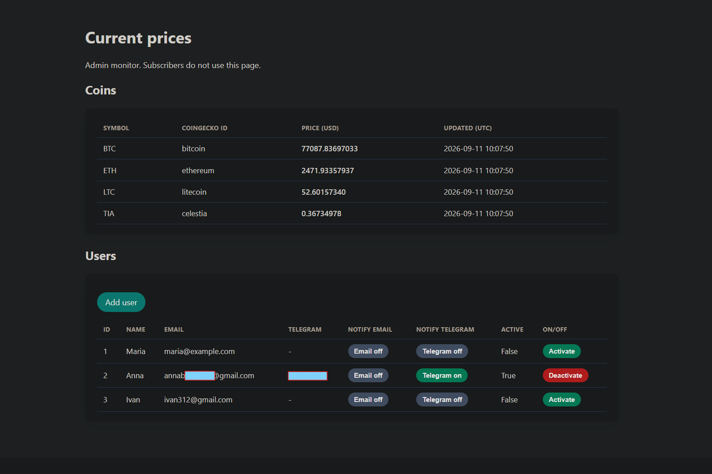
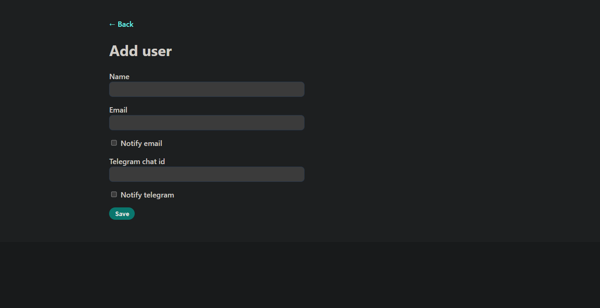

# Crypto Alert Service

Personal crypto price monitor: a background worker polls [CoinGecko](https://www.coingecko.com/), stores the latest prices, and notifies subscribers over **Telegram** and **email** when a coin crosses an `above` / `below` threshold.

An admin dashboard lists prices and subscribers. Recipients never log in — they only receive messages.

This is a **finished local tool**, not a multi-tenant SaaS. The admin UI has no login; run it on your machine.

<p align="center">
  
</p>

<p align="center"><em>Dashboard — prices from SQLite, subscribers with Email / Telegram / Active toggles.</em></p>

---

## What it demonstrates

| Area | In this repo |
| --- | --- |
| Async Python | `asyncio` + `aiohttp` worker in the same process as FastAPI |
| Data model | SQLAlchemy / SQLite: coins, current prices (1:1), users |
| HTTP | Jinja admin UI + `GET /api/prices` for in-place table updates |
| Integrations | Telegram Bot API, Gmail SMTP (app password) |
| Product rules | Per-user channel flags, alert anti-spam, isolated send failures |
| Ops | Docker Compose, `.env` for secrets, pytest without the network |

---

## Features

- Configurable coin list and thresholds in `config/config.json`
- Worker writes the current price to SQLite (and a gitignored JSON snapshot)
- Dashboard at `/` — server-rendered first paint, then JSON poll every 60s (no full-page refresh)
- Add subscribers with email and/or Telegram chat id; toggle channels and `active` from the table
- Alerts go only to **active** users whose flags and contact fields match
- A fired threshold stays quiet until the price leaves the range and enters it again
- Server credentials stay in `.env`; recipient addresses live in the database

<p align="center">
  
</p>

<p align="center"><em>Add user — channel checkboxes are validated against the contact fields.</em></p>

Example alert:

```text
BTC price ABOVE 100000.00

Current price BTC: 81466.37 USD
```

---

## Architecture

```text
CoinGecko  ──►  worker (poll + alerts)
                    │
                    ├── SQLite (coins, prices, users)
                    ├── FastAPI  ──►  /           HTML dashboard
                    │                 /api/prices JSON for the table
                    └── notifier  ──►  Telegram / SMTP
                                          (per user, errors isolated)
```

Secrets vs recipients are split on purpose: `EMAIL_USER`, `EMAIL_PASSWORD`, and `TELEGRAM_TOKEN` authenticate the **sender**. Who gets a message is decided in the admin UI (`notify_email`, `notify_telegram`, `active`). `notifications.*.enabled` in config only means “this channel exists on the server”.

Prices use `Decimal`. CoinGecko HTTP 429 increases the poll interval. Tests cover alert state, `notify_users` routing, and `require_secrets`.

---

## Layout

```text
app/
  web.py              FastAPI routes; starts the worker on startup
  worker.py           Poll, persist, notify
  models.py           Coin, Price, User
  config.py           config.json + environment
  services/           prices, alerts, Telegram, email
  storage/            SQLite repositories + JSON snapshot
templates/  static/   Admin HTML, CSS, prices.js
docs/                 README screenshots
tests/                pytest (no network)
config/config.json    Coins, intervals, channel availability
.env.example          Sender secrets template
```

---

## Quick start

```bash
git clone https://github.com/CppLover-code/Crypto-alert-service.git
cd Crypto-alert-service
python -m venv .venv
```

Windows: `.venv\Scripts\activate`  
Linux / macOS: `source .venv/bin/activate`

```bash
pip install -r requirements.txt
cp .env.example .env   # Windows: copy .env.example .env
```

Fill `.env` (`EMAIL_USER`, `EMAIL_PASSWORD`, `TELEGRAM_TOKEN`). Do not commit it.

- Gmail: [app password](https://support.google.com/accounts/answer/185833), not the account password.
- Telegram: bot from [@BotFather](https://t.me/BotFather). The subscriber must send `/start` once. Chat id goes in the admin form, not in `.env`.

```bash
uvicorn app.web:app --reload --port 8080
```

Open [http://127.0.0.1:8080](http://127.0.0.1:8080) (port 8000 is often blocked on Windows). This starts the UI **and** the worker. Do not also run `python -m app.main` — that double-polls CoinGecko.

Worker only:

```bash
python -m app.main
```

### Docker

```bash
docker compose up --build
```

Same URL. Compose publishes `8080` on all interfaces — still for a local machine, not a public VPS. `./data`, `./logs`, and `./config` are mounted and survive `docker compose down`.

---

## Tests

```bash
pytest -q
```

No CoinGecko, Telegram, or Gmail required.

---

## Scope

Intentionally out of this project: OAuth, Postgres, Redis, WebSockets, per-user thresholds, and Telegram self-service.

If this grew further, the first production step would be a password (or similar) on the admin routes.

---

## License

[MIT](LICENSE)
